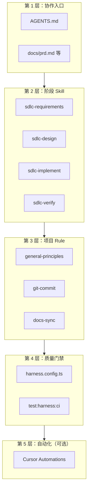

# AI 工作流总览

**版本：** v1.1  
**最后更新：** 2026-07-27

---

## 1. 目标

让 Cursor Agent 在任意 Web 项目中，按统一流程协作：

1. 先读边界（AGENTS.md）
2. 按阶段 Skill 执行（需求 → 设计 → 实现 → 验证 → 发布）
3. 遵守项目 Rule（编码/提交/文档）
4. 合并前通过 Harness 门禁

## 2. 五层架构

## 3. SDLC 阶段与触发词

| 阶段 | Skill | 用户怎么说 | Agent 做什么 | 暂停点 |
|------|-------|-----------|-------------|--------|
| 需求对齐 | `sdlc-requirements` | 「对齐需求」「FU-xxx」 | 读/写 PRD，**不写代码** | **CP-01** |
| 设计拆分 | `sdlc-design` | 「拆任务」「技术方案」 | 输出任务清单、验收 | **CP-02** |
| 编码实现 | `sdlc-implement` | 「开始实现」 | 声明范围后编码 | CP-03/04 若触发 |
| 验证门禁 | `sdlc-verify` | 「验收」 | 跑 harness → P1（若触发） | **CP-05** |
| P1 预 Review | `sdlc-verify` | 自动（harness 后） | Bugbot 互查（Reflection） | 无需回复，等 CP-05 |
| Code Review | `sdlc-review` | 「提交」时自动 | Bugbot [+ Security]（Reflection） | **CP-06 步骤1** |
| 提交 | `sdlc-review` + git-commit | 「确认提交」 | commit 计划 | **CP-06 步骤2** |

**人工暂停点完整定义：** [human-checkpoints.md](human-checkpoints.md)  
**每个 CP 判什么：** [decision-rubrics.md](decision-rubrics.md)（决策包：目的 → 判据 → 自检 → 推荐 → 选项）

## 4. 与人协作的硬性节奏

**策略：稳健优先（半自动）。** 详见 [human-checkpoints.md](human-checkpoints.md) · [decision-rubrics.md](decision-rubrics.md)。

1. **CP-01～10**：每个 CP 须输出 **决策包**（①目的 ②判据 ③自检 ④推荐 ⑤选项）
2. **CP-01**：需求对齐后 **必须停**，等人确认
3. **CP-02**：设计输出后 **必须停**，等「开始实现」
4. **CP-05**：验证与 Reflection（P1）汇报后 **必须停**，不得自动 commit
5. **CP-09**：一项完成后 **必须停**，不得自动开下一项
6. **提交前必跑** `test:harness:ci` +（若触发）**P1 Reflection** + `sdlc-review`（CP-06 Reflection）
7. **Reflection 轮次须用 `🔄 Reflection` 标题告知用户**（见 [code-review.md](code-review.md) §11）

## 5. Skill 分工

| 类型 | 位置 | 职责 |
|------|------|------|
| SDLC 流程 Skill | 本仓库 `.cursor/skills/sdlc-*` | **何时做什么** |
| 技术规范 Skill | `~/.cursor/skills/web-*` | **怎么做**（API、DB、组件、测试、提交） |

示例：用户说「实现用户列表 API」

1. `sdlc-implement` → 声明文件范围、读 AGENTS.md
2. `web-api-route-standard` → 写 route 规范
3. `web-db-design-standard` → 表设计（若需要）
4. `sdlc-verify` → 跑 test:harness:ci →（若触发）P1 Reflection → CP-05

## 6. 各阶段文档

- [01-requirements.md](stages/01-requirements.md)
- [02-design.md](stages/02-design.md)
- [03-implement.md](stages/03-implement.md)
- [04-verify.md](stages/04-verify.md)
- [05-release.md](stages/05-release.md)

## 变更记录

| 日期 | 版本 | 说明 |
|------|------|------|
| 2026-09-08 | v1.2 | 新增 P1 预 Review 与 Reflection 用户可见标识（code-review §10–§11） |
| 2026-07-27 | v1.1 | 新增决策判据层 decision-rubrics + 决策包 |
| 2026-07-17 | v1.0 | 首版：五层架构与阶段 Skill 定义 |
